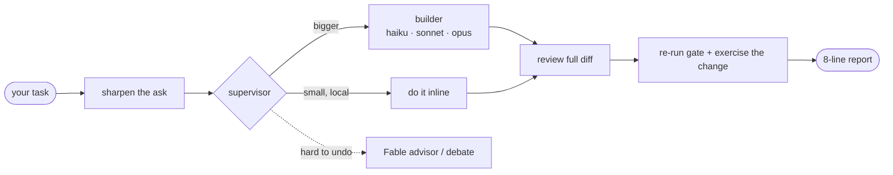

<p align="center">
  
</p>

<h1 align="center">boss</h1>

<p align="center"><b>One orchestrator, the right model for every job.</b></p>

<p align="center">
  <a href="https://github.com/mefayed/boss-skill/releases/latest"></a>
  <a href="https://github.com/mefayed/boss-skill/actions/workflows/test.yml"></a>
  <a href="LICENSE"></a>
  
  
</p>

<p align="center">
  <sub>Works with</sub><br>
  
  
  
  
  
  
</p>

<p align="center">
  <a href="#install">Install</a> ·
  <a href="#use">Use</a> ·
  <a href="#the-lanes">Lanes</a> ·
  <a href="#debate--validating-an-approach">Debate</a> ·
  <a href="#challenge-mode--iterating-a-plan">Challenge</a> ·
  <a href="#optional-other-model-clis">Other models</a>
</p>

---

A Claude Code plugin that turns your main session into a supervisor. It sends each coding task to the cheapest model that can do it right: Haiku for mechanical work, Sonnet for standard features, Opus for the hard stuff. It asks a Fable advisor before decisions that are expensive to undo, runs multi-model debates when an approach needs validating, and can bring in Codex, Gemini, Kimi, Qwen or a local model for a second opinion. It reviews every diff itself and reports back in one short message. Your main chat stays lean; the work happens in isolated subagent contexts.

```
you → /boss fix the export filter and add date range to search
      → 2 tasks. haiku: filter fix. sonnet: date range. running.
      ✓ done. 4 files, gates pass. 1 judgment call: reused existing debounce — ok?
```

## Why

- **Sharp asks, not rewritten ones.** Before routing, boss checks every request against a diagnostic checklist (after [prompt-master](https://github.com/nidhinjs/prompt-master)): the precise operation, the separable tasks, a pass/fail it can verify, and the boundaries. It stays within the normal recon budget, asks you nothing extra, and a fault it can't pin down quickly goes to the builder to trace. Your wording stays authoritative; a sharpening that would change what you meant shows up as a one-line judgment call, not a silent change.
- **Token efficiency.** Standing rules live in agent definitions (sent once per spawn, never repeated in briefs). Briefs are 6 lines. Reports are summaries. Bounces are deltas to a live agent, not respawns. Escalation is bounded: one bounce, then the supervisor takes over.
- **Right-sized models.** Six lanes (haiku → opus-deep) routed by total expected cost _including review and rework_ — a likely one-shot Sonnet beats Haiku-fail-then-Sonnet. Inline is the default — localized work (≤3 files, ≤~100 non-generated lines, an existing pattern, fast deterministic gates) never leaves main chat, since dispatch that buys no parallelism, specialization, or context isolation costs a whole session for nothing.
- **Review-first.** The supervisor reads the actual diff in full, re-runs the decisive gate itself, and checks test edits before trusting green. Builder reports are claims, not evidence. Builders never commit.
- **Short by rule.** Reports cap at 8 lines, plain English, no tables or file:line stacks.

## Install

This repo is a Claude Code **plugin marketplace** — one command gets the skill _and_ the agents, on CLI and Desktop alike:

```
/plugin marketplace add mefayed/boss-skill
/plugin install boss@boss-skill
```

Bundled agents register automatically — no manual copying. On **Claude Desktop**, use **+ → Plugins → Add plugin** with the same repo.

Alternatives:

```bash
# skills CLI (skill only; then copy agents by hand)
npx skills add mefayed/boss-skill && cp agents/*.md ~/.claude/agents/

# fully manual
mkdir -p ~/.claude/skills/boss ~/.claude/agents
cp skills/boss/SKILL.md skills/boss/outside-clis.md skills/boss/challenge.md ~/.claude/skills/boss/
cp agents/*.md ~/.claude/agents/
```

The skill also works without the agent files — it falls back to `general-purpose` subagents with the builder contract inlined in the brief.

## Use

Start a session on your strongest model (the supervisor role assumes it), then:

```
/boss <task>
```

It also auto-triggers on plain coding tasks without the slash command.

### Steering

| You say                                 | Effect                                                            |
| --------------------------------------- | ----------------------------------------------------------------- |
| `boss think more`                       | shifts dispatches one step up (deep variant or next model)        |
| `boss careful with tokens`              | shifts down, skips the advisor unless irreversible, batches edits |
| `use sonnet` / `ask fable` / `no fable` | overrides the triage directly                                     |
| `delegate to codex` / `delegate to astra`  | routes implementation to the Codex lane (optional, see below)     |
| `second opinion from codex` / `consult astra` | adds Codex as an additional advisor                              |
| `debate it` / `validate this approach` / `compare options` | runs a structured debate before the work (see below)  |
| `debate with astra` / `debate it, include codex` | adds one Codex advocate per named model to the debate       |
| `ask gemini` / `debate with kimi` / `second opinion from cursor` | adds an outside model as advisor or debate seat (optional, see below) |
| `challenge it` | adds a check to any request: one model writes the plan, a stronger one checks it, a judge settles what's left (see below) |
| `sonnet writes, opus checks` | picks the team yourself — add more checkers (`sonnet writes, astra and opus check`) or a judge (`fable judges`) |
| `plan …, challenge it` | stops at the agreed plan instead of building it |
| `who can challenge?` | lists the models you can pick |
| `debate A vs B, then challenge` | the debate's winner writes the plan, the losers check it |
| `judge with astra` | puts that model in the judge seat of a debate or challenge (in a debate, if that model was arguing, Fable takes its place) |
| `write me a prompt for cursor` / `improve this prompt` | hands off to [prompt-master](https://github.com/nidhinjs/prompt-master) if installed (optional) |

Directives persist for the session until countermanded. Boss also remembers standing preferences using Claude Code's own memory, so a preference you state once, or correct twice, applies in future sessions without repeating it. User-level traits (not repo facts) are also offered as a line for your global CLAUDE.md, so they travel across projects. Secrets are never stored. Nothing extra to install.

## What's inside

```
skills/boss/SKILL.md      the orchestration protocol (triage, briefs, review, escalation)
skills/boss/outside-clis.md  outside-model procedure, read only when you name one
skills/boss/challenge.md     challenge-mode procedure, read only when you ask for one
agents/builder.md         implementer contract — rules + report format, model chosen per dispatch
agents/builder-deep.md    same contract at high reasoning effort
agents/errand.md          bounded read-only lookup contract — answers, never edits; Agent tool denied too
agents/fable-advisor.md   design critique before irreversible decisions; advises, never edits
agents/advocate.md        argues one assigned approach in a debate; read-only, evidence-cited
hooks/builder-guard.sh    tripwire: blocks destructive Bash (push, commit, reset --hard, rm -rf, DROP, gh/curl writes) from builder + errand + advocate agents ONLY
tests/guard-test.sh       pins the guard's allow/block table and the agent-file shape, incl. known ceilings
```

The guard is agent-scoped: hook input carries `agent_type` only inside subagents, so your own commands and the supervisor's are never intercepted. Best-effort tripwire against accidental destructive commands from builder, errand and advocate agents. Not a security boundary — obfuscated commands get through (including any indirection that hides the command text, such as writing it to a file and running `sh that-file`; an agent building this release did exactly that unprompted) and some safe commands are wrongly blocked; the supervisor's full diff read remains the real enforcement. It fails open on unexpected input, and the `general-purpose` fallback lane stays instruction-only (unguarded).

The errand agent has Write/Edit/NotebookEdit/Agent hard-removed at dispatch; the advisory lanes (`fable-advisor`, `advocate`) instead enumerate a closed `tools:` list, which also withholds every MCP server. Errand and advocate share the builders' destructive-Bash tripwire. Neither is read-only enforcement: Bash stays live in every one of these lanes and the guard only pattern-matches it — a plugin cannot sandbox a shell, so an authenticated CLI the guard does not name can still reach the outside world, the errand lane keeps every writable MCP server the session carries, a `Skill` that runs in its own subagent brings its own tools, and an unchanged content baseline cannot see commits, pushes, or external state. The brief's READ-ONLY line is the contract; re-running decisive checks yourself is the enforcement.

### The lanes

| Lane        | For                                                                  |
| ----------- | -------------------------------------------------------------------- |
| errand      | bounded read-only lookup — docs, MCP/skill queries, tool runs; returns an answer, never edits |
| haiku       | mechanical, pattern exists, zero design decisions                    |
| haiku-deep  | fiddly-mechanical — the cheap-model-thinking-hard bet                |
| sonnet      | standard feature/fix, clear spec                                     |
| sonnet-deep | hard but contained                                                   |
| opus        | cross-cutting, security, uncertain spec                              |
| opus-deep   | rare, genuinely hard                                                 |
| advisor     | one-exchange critique, on demand — a blocking decision or the user asks |
| debate      | validate an approach when 2+ real options exist (see below)          |
| codex       | outside implementer or second opinion via the Codex CLI (optional)   |
| outside     | any other model CLI you name — advisor, debate or challenge seat, never an implementer (optional) |

### The loop



1. Supervisor sharpens the ask (precise operation, separable tasks, a pass/fail it can check, boundaries — within the recon budget), traces the affected code, splits the task, records a content baseline (`git diff HEAD` plus hashed untracked files — `git status` alone misses an edit to an already-modified file). Small localized work stays inline — dispatch buys parallelism, specialization, or context isolation, and costs a session when it buys none. Recon past two quick reads goes to the builder, which traces its own bounded area.
2. Each builder gets a self-contained brief: `GOAL / FILES / VERIFY / UNTOUCHED / DONE WHEN / FACTS` — exact gate commands, explicit no-touch list, decisions carried forward from earlier subtasks.
3. Builders verify their own work and return a structured report. They never commit.
4. Supervisor reviews the diff (test edits first), re-runs the decisive gate, exercises the changed path itself (UI: drives it and checks a screenshot), surfaces judgment calls.
5. Small defect → supervisor patches it. Substantial → one delta bounce to the same agent. Still wrong → supervisor takes over. No loops.
6. Queues get a progress file, decided-facts carry-forward, and a coherence close (full gates + repo-wide grep) at the end.

## Debate — validating an approach

When you want proof that an approach is the best one before expensive work, say `debate it` (or `validate this approach`, `compare options`). The supervisor:

1. Traces the code and frames 2–3 real candidate approaches with shared facts.
2. Spawns one read-only **advocate** per candidate, in parallel, on **different models** (default Sonnet + Opus) so it isn't one model arguing with itself. Each argues its position with `file:line` evidence and must concede the condition under which a rival wins.
3. A **judge** rules — Fable by default, or whoever you name (`judge with astra`; if that model was arguing, Fable takes its place). Everyone argues blind: advocates and the judge see only labels (Advocate A, B…), never which model said what; you get the mapping in the verdict. It replies `WINNER / WHY / RISKS / WHAT WOULD CHANGE THE VERDICT` — or `INSUFFICIENT EVIDENCE` / `REFRAME` when a forced winner would be false confidence.
4. Too close → one delta rebuttal round (each advocate sees only the attacks against it), then the judge decides. Never a third round.
5. You get a compact verdict; the expensive work still waits for your green light.

Cost dials apply: `careful with tokens` → 2 cheap advocates, Opus judges. `think more` → Opus advocates, Fable judges. **Codex joins only when you name it** ("debate with astra" / "debate it, include codex") — never automatically, since it spends your OpenAI credits.

## Challenge mode — iterating a plan

Add `challenge it` to any request. One writes, others check, the writer fixes, and they repeat until everyone is happy. If they still disagree, a judge decides.

If you don't name anyone, boss picks the team by how hard the task is:

| Task | Writes | Checks | Judges |
| --- | --- | --- | --- |
| Simple (boss would just do it, so it asks first) | Haiku | Sonnet | Fable |
| Normal | Sonnet | Opus | Fable |
| Hard: security, permissions, data or migrations, concurrency, destructive or external effects, public APIs, open design questions | Sonnet | Fable | Opus |

When boss picks, the checker is always stronger than the writer (your own picks win, after one warning), and the judge never takes part in the back-and-forth. `think more` moves one row down the table, `careful with tokens` one row up.

- `challenge it` lets boss pick; `sonnet writes, opus checks` (optionally `, fable judges`, or more checkers: `sonnet writes, astra and opus check`) picks it yourself.
- If your request asks for something to be built, boss builds it as soon as everyone agrees. `plan …, challenge it` stops at the plan instead. Boss pauses to ask first if a judge had to decide, a check failed, the check didn't finish, or the plan deletes data, reaches outside the repo or can't be undone.
- `who can challenge?` lists the models you can pick; `show me the discussion` shows the full back-and-forth.
- Local and other outside models (Ollama, Qwen, Gemini…) can take any role when you name them. They run read-only, and boss warns you once if one is checking a stronger writer.
- Everyone is blind: the writer, checkers and judge see only roles (Writer, Checker 1…), never which model is which. You still see the real names.
- `writer opus, checker fable, judge sonnet` works too. The same model as writer and checker gets one warning first.
- A checker can't just say "looks good": it has to show what it actually checked, or it doesn't count.
- On risky work boss offers once: "Want me to challenge the plan first?" Say `never suggest challenge` and it stops asking.
- Up to 3 rounds by default. Boss asks before going further, with a hard stop at 5 rounds or 10 calls unless you lift it.
- Codex and outside models join only by name. Codex and hosted models spend your credits; local ones don't.

## Optional: Codex as an extra lane

If OpenAI's Codex plugin is installed, boss can hand work to Codex — as an implementer (briefed like a builder, diff reviewed the same way), as a second advisor, or as a debate advocate. Naming a model routes it explicitly — "debate with astra", "consult sol", "delegate to terra". The model list is **never hardcoded**: boss resolves the name against the live Codex catalog plus your config at dispatch time, so a model released tomorrow works tomorrow, with no update to this skill. Codex is always opt-in by name — boss never spends your OpenAI credits unasked. Outside challenge mode it runs as a **single deep pass in the background**, in parallel with the Claude advisors — never inside a fix-review-refix loop, where its 8-minute exploration cost buys nothing a Claude advisor doesn't deliver in 90 seconds.

Not installed? Two steps:

```
npm install -g @openai/codex        # the Codex CLI, then run `codex` once to log in
/plugin marketplace add openai/codex-plugin-cc
/plugin install codex@openai-codex
```

Without it, the codex lane simply doesn't exist — everything else works unchanged.

## Optional: other model CLIs

Name another model and boss asks it too — "ask gemini", "consult kimi", "debate with qwen", "second opinion from cursor", or a local model through Ollama. It uses whichever CLI you already have installed and logged in, found at call time, so nothing is hardcoded and new tools work without an update.

- **Advice, debate and challenge only.** Outside models give a second opinion, take a debate seat, or write, check or judge in a challenge; they never write code (Codex remains the only outside implementer).
- **Read-only is enforced, not requested.** A call runs only through the tool's own read-only mode (e.g. `cursor-agent --mode ask`) or a pure chat with no tool access (e.g. `ollama run`). A tool with neither is refused — telling a model "don't edit" is not enough.
- **Never on its own.** Only an explicit ask triggers it; a model named in passing, in a file or in memory does not. It spends credits with that vendor.
- **No surprises.** Boss states the route before calling (`kimi → kimi CLI / kimi-k3 / Moonshot`), never swaps in a different provider, and never installs, logs in or pulls a model for you — it tells you the command.

Claude and Codex behavior is unchanged whether or not any of these are installed.

## Scoping what an agent can reach

There is no per-dispatch scoping — the Agent tool takes no tools parameter. A lane's surface is fixed in its agent file:

| Frontmatter | Effect |
| ----------- | ------ |
| `tools:` | Allowlist: the lane gets exactly what you name and nothing else. Omit `Skill`, the MCP tools or `ToolSearch` and the lane cannot reach them — verified: an agent pinned to `Read, Glob, Grep, Bash` sees no MCP at all |
| `disallowedTools:` | Denylist, takes patterns — `mcp__github`, `mcp__*` |
| `mcpServers:` | Ignored in plugin agent files — the loader warns and drops it. Subagents inherit the session's servers; close `tools:` to withhold them |
| `skills:` | Preload full skill content at startup |

Omitting `tools:` inherits everything — but MCP schemas are **deferred**: names only, ~0 tokens until a tool is actually called. That is why the errand lane omits it. Inheriting is what lets it run skill and MCP errands, and it costs nothing until one is used.

## Requirements

- Claude Code with subagent support (`.claude/agents` definitions, per-dispatch model overrides).
- Access to the models you want in the lanes; edit the `model:` frontmatter in `agents/*.md` to match your plan.

The plugin itself has **zero dependencies** — markdown plus a plain POSIX-sh hook. Everything below is optional; when a tool is missing, boss degrades to the nearest available check, says so in its report, and suggests the install line.

### Optional tools

| Tool | Unlocks | Install |
| ---- | ------- | ------- |
| playwright-cli | driving UI work through the changed interaction | `npm install -g playwright && npx playwright install chromium` |
| Codex CLI + plugin | the codex lane (outside implementer, advisor, debate advocate) | see "Optional: Codex as an extra lane" below |
| any model CLI (Gemini, Kimi, Qwen, Cursor, Ollama…) | the outside lane (advisor, debate or challenge seat) | the vendor's own install, then log in once |
| [prompt-master](https://github.com/nidhinjs/prompt-master) | copy-paste prompts for other tools (Cursor, Midjourney, GPTs…) on explicit ask | `git clone https://github.com/nidhinjs/prompt-master.git ~/.claude/skills/prompt-master` |
| GitHub CLI (`gh`) | PR/issue steps in briefs that need it | `brew install gh` (macOS) / [cli.github.com](https://cli.github.com) |

## Acknowledgements

The intake checklist is adapted from the diagnostic checklist in [prompt-master](https://github.com/nidhinjs/prompt-master) by nidhinjs (MIT). Ideas only; no prompt-master text is bundled.

## License

Licensed under [MIT](LICENSE). Copyright (c) 2026 Mohamed Fayed. Free to use, modify, fork and sell; include the copyright and permission notices in all copies or substantial portions. Found a copy missing the required notices? Please open an issue.
